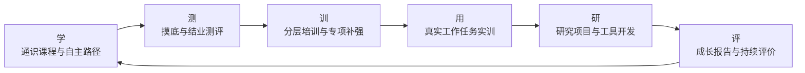
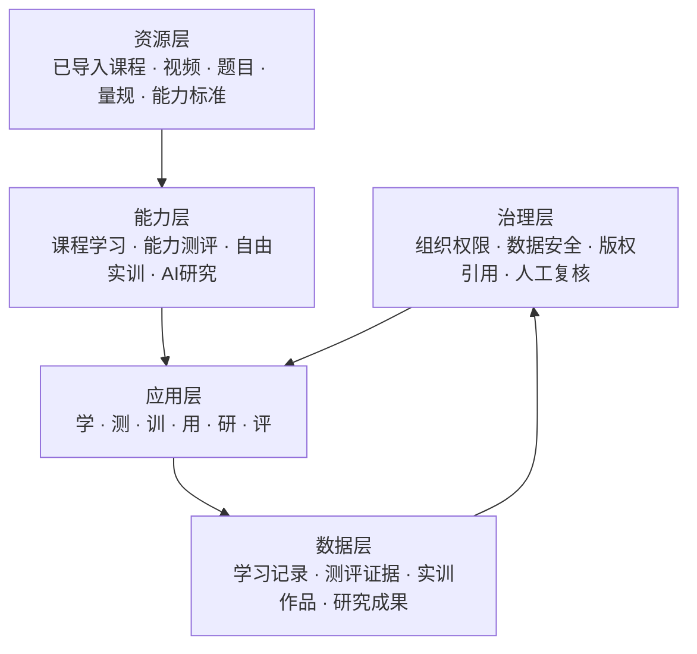
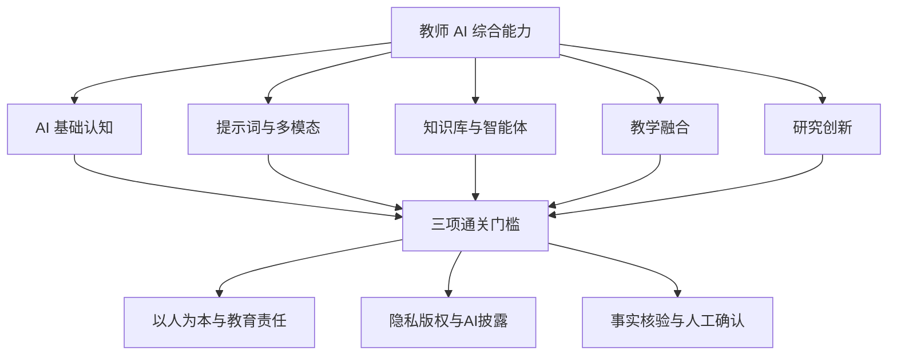
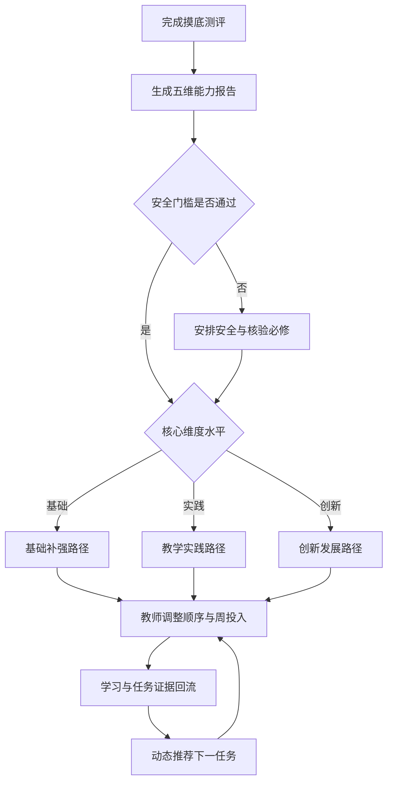
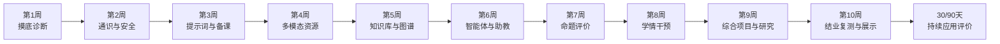
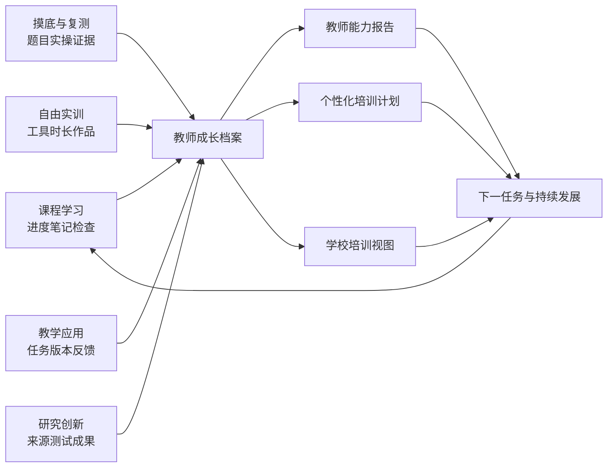
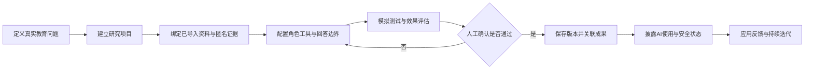

# 启境教师 AI 能力提升与创新应用培训解决方案

> **面向对象：** 中小学、高职、高校及教师发展机构的一线教师、教研人员、课程负责人和学校管理者  
> **标准周期：** 10 周，60 学时；结业后设置 30 天与 90 天持续应用评价  
> **核心定位：** 以启境平台为统一载体，把课程学习、能力测评、分层培训、真实任务实训、研究创新和成长评价连接为可持续运行的教师 AI 能力发展体系

## 1. 方案总览

### 1.1 建设背景

生成式 AI 正在快速进入备课、资源制作、课堂答疑、作业评价、学情分析、课程建设和教育研究。学校面临的关键问题已经不再是“是否组织一次 AI 培训”，而是如何让教师在安全、可控、可评价的前提下，把 AI 真正转化为教学能力、研究能力和持续创新能力。

常见的短期工具培训往往存在四个断点：

| 学校面临的问题 | 直接表现 | 启境平台的解决方式 |
| --- | --- | --- |
| 培训起点不清楚 | 不同基础教师学习相同内容 | 先测评、后分层，生成个人能力报告与培训计划 |
| 学习与工作相脱离 | 看完课程但不会处理真实任务 | 以教师自己的备课、评价、助教和研究任务作为训练载体 |
| 过程无法连续评价 | 只记录签到、视频完成和一次考试 | 统一记录学习、测评、实训、作品、复核和研究证据 |
| 培训结束即中断 | 结业后没有工具、项目和成长路径 | 继续开放自由实训、科研智能体、复测和成长报告 |

本方案将培训设计为一套平台驱动的能力运营机制：学校在同一平台内完成培训组织和效果观察，教师在同一身份下完成学习、训练、应用与研究，所有过程证据持续进入个人成长档案。

> **方案主张**
>
> 教师 AI 赋能不是一次课程活动，也不是若干工具的集中展示，而是“能力标准—诊断测评—个性化学习—真实工作实训—研究创新—持续评价”共同构成的专业发展体系。启境平台是该体系的运行底座、工具入口、证据中心和持续成长空间。

### 1.2 建设目标

项目围绕教师、学校和组织发展三个层面形成目标。

**教师层面**

1. 理解 AI 的基本原理、能力边界、风险和教育应用原则。
2. 能够使用提示词、多模态、知识库和智能体完成高质量工作产物。
3. 能够把 AI 应用于备课、教学、测评、反馈、学情分析和分层支持。
4. 能够围绕真实教育问题开展研究，设计科研智能体或轻量 AI 工具。
5. 形成有证据、可复核、可持续更新的个人 AI 能力档案。

**学校层面**

1. 掌握教师 AI 能力基础、群体短板、培训进度和发展成效。
2. 建立分类分层、任务驱动、过程可视的教师发展机制。
3. 沉淀校本提示词、教学案例、任务成果、知识库、智能体和研究成果。
4. 建立隐私、版权、引用、人工确认和 AI 使用披露规范。

**组织发展层面**

1. 从少数教师的工具试用，走向可复制的校本 AI 应用体系。
2. 从培训完成率，走向能力增值、工作迁移和创新成果评价。
3. 识别骨干教师和引领者，形成同伴支持与校本推广网络。

### 1.3 “学、测、训、用、研、评”总体闭环

**图 1　教师 AI 能力提升全流程闭环**

六个环节不是彼此独立的模块，而是由统一教师身份、统一能力标准和统一成长档案连接起来：

- “学”解决知识输入和自主发展问题。
- “测”识别真实起点、短板和变化。
- “训”根据诊断结果提供公共必修与专项补强。
- “用”把培训迁移到教师高频工作任务。
- “研”支持教师从应用者成长为创新者。
- “评”把过程证据转化为个人与学校可使用的发展依据。

### 1.4 项目交付成果

项目结束后，学校可形成以下成果：

- 每名教师一份摸底能力报告、一份个性化培训计划和一份结业发展报告。
- 一套基于教师真实工作的 AI 培训任务体系和评价量规。
- 一批可复用的教案、课件结构、评价任务、知识库、智能体和学情改进方案。
- 一批具备来源引用、人工确认和 AI 使用披露的研究成果或工具原型。
- 一套可持续运行的培训数据、成长记录、预警规则和校本推广机制。

> **平台赋能**
>
> 启境平台不只是培训内容的播放入口，而是贯穿课程开通、能力诊断、计划生成、资源学习、工具实训、作品评价、科研创新和成长复测的统一工作空间。

<!-- pagebreak -->

## 2. 启境平台赋能架构

### 2.1 总体架构

启境平台以教师成长档案为数据主线，将外部导入的课程与测评内容、平台内的学习与实训能力、教师真实工作任务以及学校的管理要求组织为五层架构。

**图 2　启境平台教师 AI 赋能总体架构**

| 架构层 | 核心内容 | 对学校的作用 |
| --- | --- | --- |
| 资源层 | 已导入课程、视频、文档、案例、题目、量规和能力标准 | 使用统一内容基线组织不同批次培训 |
| 能力层 | 课程学习、能力测评、培训计划、自主路径、自由实训、AI 研究 | 提供教师成长所需的完整平台能力 |
| 应用层 | 学、测、训、用、研、评六类活动 | 将学习转化为工作应用和研究创新 |
| 数据层 | 学习记录、测评证据、任务作品、人工反馈、研究成果 | 形成个人成长档案与学校群体画像 |
| 治理层 | 权限、隐私、版权、来源、人工确认和 AI 披露 | 保证培训和应用安全、可信、可追溯 |

### 2.2 平台在培训中的五种角色

1. **培训组织平台**：承载课程开通、教师报名、培训计划、任务安排和进度提醒。
2. **能力诊断平台**：组织理论题、情境判断和实操任务，形成五维能力报告。
3. **AI 实训平台**：提供十三类共享 AI 工具和有前置关系的真实工作任务。
4. **研究创新平台**：支持研究项目、资料绑定、科研智能体、版本测试和成果关联。
5. **成长评价平台**：汇集学习、测评、作品、人工反馈和复测结果，形成持续发展报告。

### 2.3 教师工作与个人成长双空间

教师始终保持教师身份，在启境平台内使用两个相互连接、数据边界清晰的工作空间：

| 工作空间 | 主要目标 | 典型活动 | 数据归属 |
| --- | --- | --- | --- |
| 教学工作 | 完成日常教、学、测、评、研任务 | 智能备课、学习促进、测评管理、教学诊断、AI 研究 | 教师有权管理的课程、班级与研究项目 |
| 我的成长 | 完成个人学习、实训和能力发展 | 摸底测评、培训计划、课程学习、自主路径、实训记录、能力复测 | 教师个人课程、进度、作品与能力档案 |

两个空间之间形成能力回流：教师在个人成长空间学习和实训，在教学工作空间完成真实应用；工作成果又成为个人能力报告和学校培训评价的证据。

### 2.4 共享 AI 工具体系

“自由实训”与“AI 研究”使用同一套工具目录，避免培训工具、研究工具和教学工具形成彼此割裂的能力孤岛。

| 工具类别 | 代表工具 | 主要应用 |
| --- | --- | --- |
| 研究与证据 | 深度研究助手、文献研读与证据库、研究数据分析室 | 文献梳理、证据组织、数据分析 |
| 提示与多模态 | 提示词实验室、多模态内容工坊、文生视频工坊、多模态识别 | 文本、图像、视频和课堂材料处理 |
| 知识与智能体 | 知识库 RAG、Dify 应用实验台、智能体搭建台、MCP 工具连接台 | 知识库、工作流、智能体和工具连接 |
| 开发与评测 | Vibe Coding 工作台、模型评测场 | 轻量原型、模型比较、效果与风险测试 |

> **平台赋能**
>
> 教师在课程学习中认识工具，在自由实训中掌握工具，在教学工作中使用工具，在 AI 研究中组合工具；同一能力可以跨学习、应用和研究持续积累证据。

## 3. 科学依据与培训原则

### 3.1 设计依据

本方案综合以下框架，并结合中国学校教师真实工作情境进行本地化设计：

- UNESCO《教师人工智能能力框架》强调以人为本、AI 伦理、AI 基础与应用、AI 教学法和 AI 促进专业学习五个方面，并采用分层发展思路。
- 教育部《教师数字素养》教育行业标准强调数字化意识、数字技术知识与技能、数字化应用、数字社会责任和专业发展。
- 教育部“数字化赋能教师发展行动”强调分类分级、培训覆盖、应用驱动和实践提升。
- 欧盟 DigCompEdu 从专业参与、数字资源、教学与学习、评价、赋能学习者和培养学习者数字能力等领域描述教师数字能力。
- 《AI任务体系梳理.pdf》强调从“AI 功能列表”转向“老师的一天”，按照工作场景、使用频率、前置关系和实际产出组织任务。

### 3.2 六项培训原则

1. **真实工作优先**：以备课、课堂、答疑、作业、考试、学情分析、课程建设和教育研究为训练载体。
2. **诊断分层实施**：所有教师达到共同底线，不同基础教师获得不同补强与挑战任务。
3. **成果证据驱动**：每项训练形成可以检查、修改和复用的工作产物。
4. **人机协同决策**：AI 负责生成、整理、分析和建议，教师负责目标、事实、价值和最终判断。
5. **全过程评价**：摸底、过程反馈、结业考试、综合项目和延迟复测共同证明能力变化。
6. **安全合规通关**：隐私、版权、引用、事实核验和 AI 使用披露不能被其他高分抵消。

### 3.3 培训完成标准

教师须同时满足以下条件：

- 公共必修资源完成率不低于 90%。
- 个性化培训计划中的必修任务完成率达到 100%。
- 真实工作任务平均得分不低于 70 分。
- 结业理论与情境考试不低于 70 分。
- 平台综合实操和综合工作项目均不低于 70 分。
- 三项安全合规门槛全部通过。
- 至少形成一项能够继续用于本人工作的成果。

<!-- pagebreak -->

## 4. “5+3”教师 AI 能力模型

### 4.1 模型构成

“5+3”模型由五个计分能力维度和三项不可替代的通关门槛组成。五维能力用于识别发展水平，三项门槛用于保证教师的 AI 应用符合教育责任和治理要求。

**图 3　“5+3”教师 AI 能力模型**

### 4.2 五个计分维度

| 能力维度 | 关键问题 | 可观察行为 | 平台证据 |
| --- | --- | --- | --- |
| AI 基础认知 | 是否理解 AI 能做什么、不能做什么 | 解释基本原理，识别幻觉、偏差和错误场景 | 理论题、情境判断、风险说明 |
| 提示词与多模态 | 是否能稳定生成符合教学目标的内容 | 拆解任务、设置约束、迭代提示并评价多模态结果 | 提示词版本、生成作品、评价记录 |
| 知识库与智能体 | 是否能构建可控、可信的 AI 应用 | 建设知识库、测试检索、配置角色与回答边界 | 来源清单、测试集、智能体版本、引用记录 |
| 教学融合 | 是否真正改善教师工作和学生学习 | 将 AI 用于备课、评价、反馈和分层支持 | 教学方案、评价任务、学情诊断、干预方案 |
| 研究创新 | 是否能围绕问题形成可复核创新 | 定义问题、组织匿名证据、设计科研智能体或工具 | 研究方案、证据矩阵、智能体、原型与反思 |

### 4.3 三项通关门槛

| 通关门槛 | 必须达到的要求 | 不通过情形 |
| --- | --- | --- |
| 以人为本与教育责任 | AI 不替代教师作出关键教育判断，不削弱学生主体性 | 直接以 AI 结论给学生定性、分流或处分 |
| 数据、隐私、版权与披露 | 使用匿名或授权数据，标注来源，说明 AI 辅助范围 | 上传敏感数据、隐藏 AI 使用、无权使用材料 |
| 事实核验与人工确认 | 关键内容可回到来源，教师核验后再发布 | 无来源采纳结论、未复核即发布题目或报告 |

任一门槛未通过时，相关成果不得发布、关联研究成果或申请结业；完成整改后可再次提交复核。

### 4.4 L1—L4 能力等级

| 等级 | 能力定位 | 核心证据 | 发展方向 |
| --- | --- | --- | --- |
| L1 AI 入门者 | 能安全完成单点、高频任务 | 公共必修通过，完成至少 3 个基础任务 | 扩大日常工作应用 |
| L2 AI 实践者 | 能将多种 AI 能力用于教学工作流 | 完成核心任务链和 1 个真实工作项目 | 建设知识库与智能体 |
| L3 AI 创新者 | 能设计可复用智能体或研究应用 | 综合项目、科研智能体、成果答辩 | 推动校本创新与同伴协作 |
| L4 AI 引领者 | 能指导同伴并推动组织实践 | 30/90 天应用证据和同伴指导记录 | 形成学校推广与治理能力 |

L4 不在单次培训结束时自动授予，必须通过延迟复测、真实工作迁移和同伴影响证据确认。

> **平台赋能**
>
> 五维能力与三项门槛贯穿测评、培训、实训和研究。教师看到的不只是总分，而是每个结论对应的题目、任务、作品、反馈和人工确认状态。

## 5. 平台驱动的教师成长全流程

### 5.1 九阶段实施路径

教师从课程开通开始，在同一平台身份下完成九个连续阶段。各阶段既形成教师可感知的成果，也为学校提供可管理的数据。

| 阶段 | 平台入口与能力 | 教师活动 | 沉淀数据 | 教师成果 | 学校价值 |
| --- | --- | --- | --- | --- | --- |
| 1. 开通与导学 | 我的成长、课程学习 | 确认目标、规则、学习安排 | 报名、导学、目标声明 | 个人学习目标 | 掌握开通与参训状态 |
| 2. 通识自学 | 课程学习、笔记、收藏、继续学习 | 学习原理、伦理、案例和工具基础 | 进度、时长、知识检查、笔记 | 通识知识与风险清单 | 建立共同认知底线 |
| 3. 摸底测评 | 摸底测评 | 完成理论、情境和实操任务 | 答案、过程、作品、题型表现 | 初始能力证据 | 识别群体基础和短板 |
| 4. 报告与计划 | 能力报告、培训计划 | 解读报告、确认目标、调整顺序和投入 | 五维得分、目标、计划调整 | 个性化培训计划 | 实施分类分层培训 |
| 5. 专项培训 | 课程学习、自主路径 | 完成公共必修与短板补强 | 资源完成、笔记、任务反馈 | 专项能力提升记录 | 观察培训进度与风险 |
| 6. 真实任务实训 | 自由实训、教学工作 | 使用本人工作问题完成任务 | 工具、步骤、时长、得分、作品 | 可复用工作成果 | 验证工作迁移成效 |
| 7. 结业测评 | 能力报告、测评管理 | 完成考试、实操、项目和答辩 | 成绩、量规、人工复核 | 结业成绩与能力变化 | 判断培训质量与达标率 |
| 8. 研究与开发 | AI 研究工作台 | 建立项目、设计科研智能体或工具 | 项目、来源、版本、测试、成果 | 研究简报、智能体或原型 | 沉淀校本创新成果 |
| 9. 持续成长 | 能力报告、自由实训、复测 | 继续学习、应用、复盘和同伴指导 | 30/90 天复测与真实应用证据 | 持续发展计划 | 建立常态化教师发展机制 |

### 5.2 学习、应用与研究的连续关系

- 课程学习提供概念、方法、规范和案例。
- 个性化培训根据能力短板选择资源和任务。
- 自由实训允许教师脱离课程和班级反复练习工具。
- 教学工作将练习结果迁移到真实备课、评价和学情改进。
- AI 研究把教学问题、匿名证据和工具组合为可复核成果。
- 能力报告持续汇总上述证据并推荐下一项行动。

### 5.3 每周“学—看—做—评—改—用”节奏

1. **学**：完成当周导学资源与知识检查。
2. **看**：分析一个真实案例和一个错误案例。
3. **做**：使用平台工具完成真实工作任务。
4. **评**：接受量规评分、自动反馈、同伴反馈或教练反馈。
5. **改**：保留修改版本并说明修改依据。
6. **用**：说明成果在本人课程、班级或研究中的使用方式。

> **平台赋能**
>
> 教师可以从培训计划进入学习，从学习进入实训，从实训回到教学工作，再将代表性成果关联到研究项目；平台自动汇集过程证据，避免培训数据分散在多个系统和临时群组中。

## 6. 测评驱动的个性化培训

### 6.1 摸底测评组成

摸底成绩不计入结业总分，只用于建立起点、解释能力和生成路径。

| 测评组成 | 权重 | 主要内容 | 证据形式 |
| --- | ---: | --- | --- |
| AI 基础理论 | 20% | 原理、边界、常见风险和教育应用 | 客观题、知识点表现 |
| 教育情境判断 | 20% | 隐私、版权、偏差、核验和人机职责 | 选择、理由、风险识别 |
| 平台基础实操 | 30% | 提示词、多模态、知识库或智能体任务 | 操作步骤、提示词、生成结果 |
| 教师工作样例 | 30% | 使用 AI 改进一个真实工作任务 | 作品、修改记录、反思 |

报告呈现综合等级、五维得分、题型表现、能力证据、证据充分度、优势、短板、风险项和推荐目标，不以单一总分代替能力诊断。

### 6.2 分层路径

| 路径类型 | 主要判断 | 学习重点 | 推荐任务 |
| --- | --- | --- | --- |
| 基础补强路径 | 任一主维度低于 50，或通关门槛未通过 | 通识、安全、提示词、核验和基础工作任务 | 公共必修 + 至少 6 个基础任务 |
| 教学实践路径 | 综合能力 50—69，已有单点工具经验 | AI 助教、测评、学情分析和工作流串联 | 公共必修 + 至少 8 个核心任务 |
| 创新发展路径 | 综合能力达到 70，核心实操通过 | 研究设计、智能体、Dify、Vibe Coding 和同伴指导 | 精简基础学习 + 综合研究项目 |

### 6.3 路径生成与调整规则

**图 4　测评驱动的个性化培训路径**

平台遵循以下规则：

1. 所有人完成安全合规、AI 基础和事实核验公共必修。
2. 低于 60 分的维度至少安排 2 个补强任务。
3. 60—79 分的维度至少安排 1 个迁移任务。
4. 达到 80 分的维度可用挑战任务替代基础任务。
5. 教师可以调整学习顺序、每周投入时间和选修内容。
6. 教师不能移除公共必修、未通过门槛和计划中的必修任务。
7. 每完成资源、任务或复测，平台根据新证据更新推荐。

### 6.4 教师自主学习

教师可同时使用两条路径：

- **AI 推荐路径**：依据五维能力、未完成任务和前置关系自动排列。
- **我的路径**：教师从已导入课程、视频、资料和实训任务中自主选择并调整顺序。

平台记录视频进度、文档阅读、资源完成、收藏、笔记和继续学习位置。学习完成状态同步进入培训计划、能力证据和下一任务推荐。

<!-- pagebreak -->

## 7. 10 周 60 学时实施方案

### 7.1 学时结构

| 学习组成 | 学时 | 占比 | 主要形式 |
| --- | ---: | ---: | --- |
| 通识课程与自主学习 | 12 | 20% | 视频、文档、案例、笔记、知识检查 |
| 摸底与结业评价 | 8 | 13% | 理论题、情境题、实操、报告解读 |
| 专题工作坊与任务示范 | 12 | 20% | 方法讲解、案例拆解、错误分析 |
| 真实工作任务实训 | 20 | 34% | 自由实训、作品迭代、同伴评审 |
| 综合项目与研究开发 | 8 | 13% | 科研智能体、工具原型、成果答辩 |
| **合计** | **60** | **100%** | 线上自主学习与任务工作坊混合实施 |

正式培训前设置启动准备期，用于教师账号开通、课程报名、平台导学、培训规则确认和数据伦理承诺，不计入 60 学时。

### 7.2 实施路线

**图 5　10 周培训实施路线图**

### 7.3 周实施安排

| 周次 | 培训主题 | 平台活动 | 真实任务与成果 | 评价证据 | 学时 |
| --- | --- | --- | --- | --- | ---: |
| 第 1 周 | 摸底诊断与目标确认 | 完成摸底、查看能力报告、确认培训计划 | 个人能力目标与学习计划 | 理论、情境、实操和工作样例 | 6 |
| 第 2 周 | AI 通识与安全应用 | 学习原理、边界、隐私、版权、核验课程 | AI 风险清单与人机职责说明 | 知识检查、情境判断、反思 | 6 |
| 第 3 周 | 提示词与智能备课 | 使用智能备课和提示词实验室 | 教案、课件结构与提示词版本 | 目标匹配、约束完整、人工修改 | 6 |
| 第 4 周 | 多模态教学资源 | 使用多模态和文生视频工具 | 配图、微课脚本和资源评价记录 | 版权、准确性、教学适切性 | 6 |
| 第 5 周 | 课程知识库与知识结构 | 建设知识库、检索测试和知识图谱 | 知识库 v1.0、来源清单、测试报告 | 命中率、来源、边界与修订 | 6 |
| 第 6 周 | 智能体与 AI 助教 | 配置角色、规则、工具、测试和发布流程 | AI 助教 v1.0 与运营检查表 | 引用、越界处理、人工接管 | 6 |
| 第 7 周 | 智能命题与评价 | 完成练习、实训题、组卷、批改和复核 | 测评包、评分量规和反馈证据 | 蓝图质量、评分证据、教师修订 | 6 |
| 第 8 周 | 学情诊断与分层支持 | 查看班级态势、证据诊断和动态分组 | 学情报告与分层干预方案 | 证据充分度、干预适切性 | 6 |
| 第 9 周 | 综合应用与研究开发 | 建立研究项目、配置科研智能体 | 综合工作项目、智能体或工具原型 | 问题价值、方法、效果、合规 | 6 |
| 第 10 周 | 结业复测与成果展示 | 完成考试、实操、答辩和成长报告 | 结业成果集与持续发展计划 | 总评、前后变化、人工复核 | 6 |

### 7.4 培训组织形式

- 建议每班 30—40 名教师。
- 配置 1 名项目负责人、1 名主讲专家、1 名平台辅导员，以及每 15—20 人 1 名任务教练。
- 每周安排一次集中工作坊和一次线上答疑，其余时间用于平台自主学习和工作任务实训。
- 集中活动重点用于报告解读、方法示范、作品评审和问题改进，不重复播放平台已有课程。
- 教师尽量使用本人正在承担的课程和工作问题，平台训练材料涉及学生信息时必须匿名。

> **平台赋能**
>
> 10 周不是十次彼此独立的讲座。每一周都从培训计划进入，以平台任务作为主线，以作品和证据作为结束，并把结果同步到能力报告。

## 8. 教师真实工作任务体系

### 8.1 任务设计方法

任务体系以“老师的一天”和“课程全周期”为组织逻辑。每项任务包含真实工作目标、输入材料、平台入口、工具组合、明确产出、标准时长、前置任务、能力标签和安全检查。

训练不要求教师为了培训额外制造一套无关作品，而是优先改进其实际承担的教案、课程资源、评价任务、学情分析或研究项目。这样既降低培训负担，也能直接验证 AI 是否带来工作价值。

### 8.2 四条任务链

**图 6　四条教师真实工作任务链**

```mermaid
flowchart TB
  subgraph A[备课与资源生产]
    A1[T01 教案] --> A2[T02 课件结构] --> A3[T03 教学配图] --> A4[T05 微课方案]
  end
  subgraph B[命题评价与学情改进]
    B1[T04 随堂练习] --> B2[T06 实操考核] --> B3[T07 智能组卷] --> B4[T08 批改复核] --> B5[T09 分层干预]
  end
  subgraph C[知识库智能体与AI助教]
    C1[T10 课程知识库] --> C2[T11 检索优化] --> C3[T12 知识图谱] --> C4[T13 教学智能体] --> C5[T14 AI助教]
  end
  subgraph D[教学研究与工具开发]
    D1[T15 教学反思] --> D2[T16 能力映射] --> D3[T17 科研智能体] --> D4[T18 研究或工具原型]
  end
```

### 8.3 正文任务地图

| 任务链 | 解决的教师问题 | 核心任务 | 主要平台能力 | 代表成果 |
| --- | --- | --- | --- | --- |
| 备课与资源生产 | 如何提高备课质量并减少重复劳动 | T01、T02、T03、T05 | 智能备课、提示词、多模态、文生视频 | 教案、课件结构、配图、微课方案 |
| 命题评价与学情改进 | 如何提高命题、反馈和干预质量 | T04、T06、T07、T08、T09 | 智能出题、实训方案、组卷、批改、学习促进 | 测评包、评分证据、学情与干预方案 |
| 知识库智能体与 AI 助教 | 如何形成可持续服务课程的 AI 能力 | T10—T14 | 课程资源、RAG、知识结构、Dify、智能体 | 知识库、测试集、知识图谱、AI 助教 |
| 教学研究与工具开发 | 如何从应用走向研究与创新 | T15—T18 | AI 研究、深度研究、数据分析、Vibe Coding | 反思报告、科研智能体、研究或工具原型 |

18 项任务的完整输入、频率、时长、前置关系和能力标签见附录 A。

### 8.4 任务成果要求

每项成果至少保留：

1. 工作情境和需要解决的问题。
2. 使用的已导入资料或匿名数据。
3. 工具、提示词、参数或操作步骤。
4. 初始结果、修改版本和修改依据。
5. 教师人工核验与最终确认。
6. 来源、版权、匿名和 AI 披露状态。
7. 在本人工作中的使用计划或实际反馈。

数字人可作为 AI 助教的可选呈现形态，不作为所有教师的强制能力。培训须区分单向播报型数字人和具备知识库、智能体规则及双向交互能力的 AI 助教。

> **平台赋能**
>
> 自由实训记录工具、任务、时长、得分和作品；教学工作记录真实使用结果；二者共同回流能力报告，使“学过什么”转化为“能够完成什么”。

<!-- pagebreak -->

## 9. 测评、报告与认证体系

### 9.1 全过程评价

评价体系由摸底测评、过程评价、结业考试、综合项目和延迟复测组成，既评价知识，也评价任务作品、人工判断和工作迁移。

**图 7　学习、实训、评价与报告数据回流**

### 9.2 过程评价内容

- **资源学习**：完成度、有效学习时长、知识检查、笔记和收藏。
- **工作任务**：完成状态、作品质量、版本迭代、实际用时和量规得分。
- **实训行为**：工具选择、提示词、操作步骤、结果评价和成果。
- **反思迁移**：教师是否说明选择理由、核验方式和真实应用计划。
- **支持记录**：系统推荐、教练反馈、补交和二次提交。

过程评价主要用于调整路径和改进作品，不用于制造简单排名。

### 9.3 结业总评

| 总评组成 | 权重 | 评价重点 |
| --- | ---: | --- |
| 学习过程与专业参与 | 10% | 必修完成、有效参与、反思和同伴反馈 |
| 真实工作任务作品集 | 30% | 个人计划中的核心任务及其修改证据 |
| 理论与教育情境考试 | 20% | AI 认知、安全判断和教育责任 |
| 平台综合实操 | 15% | 限时完成提示词、知识库、评价或智能体任务 |
| 综合工作项目与答辩 | 25% | 真实问题、方法组合、效果、边界和改进 |
| **合计** | **100%** | 三项安全合规门槛另行判定 |

### 9.4 综合项目量规

| 评价维度 | 权重 | 达标要求 |
| --- | ---: | --- |
| 问题真实性与价值 | 15% | 来源于教师真实工作，目标和受益对象清楚 |
| 教学与专业适切性 | 20% | AI 使用服务于教学或研究目标 |
| AI 方法与工具组合 | 20% | 工具选择合理，工作链路完整 |
| 证据与效果 | 20% | 有测试、引用、前后对比或用户反馈 |
| 人工判断与迭代 | 15% | 有版本、核验和教师修改证据 |
| 合规与可持续性 | 10% | 隐私、版权、披露、成本和维护清楚 |

### 9.5 三类教师报告

**摸底能力报告**

- 综合等级、五维能力和题型表现。
- 每个结论对应的题目、任务或作品证据。
- 优势、短板、风险项和证据不足项。
- 个性化目标、公共必修、补强模块和推荐路径。

**过程成长报告**

- 培训计划完成情况和预计结业时间。
- 资源进度、笔记、收藏和路径调整。
- 任务完成数、得分、实际用时和作品版本。
- 教练反馈、补强记录、能力变化和下一任务。

**结业与持续发展报告**

- 摸底、结业、30 天和 90 天能力变化。
- 结业考试、综合项目和三项门槛结果。
- 代表性作品、AI 助教、科研智能体或工具原型。
- 来源引用、人工确认、数据匿名和 AI 披露状态。
- L1—L4 等级判定依据与下一阶段建议。

### 9.6 学校培训管理视角

学校关注群体趋势和项目质量，不以平台数据对教师进行简单排名。建议观察：

- 账号开通率、摸底完成率和培训计划确认率。
- 每周活跃率、有效学习率和任务按时完成率。
- 五维能力平均增值、各层级人数变化和共性短板。
- 首次通过率、修改后通过率和教练反馈响应时间。
- 三项门槛问题类型、整改情况和人工复核状态。
- 综合项目完成率、真实应用率和 30/90 天保持率。

### 9.7 延迟复测与 L4 评审

- 结业后第 30 天和第 90 天使用等值题和新工作情境复测。
- 教师提交至少一项真实应用证据和问题复盘。
- 平台对比摸底、结业和延迟复测结果。
- 能力回落时推荐复训；能够指导同伴并形成组织影响时进入 L4 评审。

## 10. 教学研究与 AI 工具开发

### 10.1 从真实问题开始

研究与工具开发不是培训结束后的附加展示，而是教师将 AI 能力迁移到专业发展和学校创新的高阶阶段。项目必须从具体问题开始，例如：

- 某类学生在一个知识点上持续出现相同误区。
- 某门课程资源分散，教师重复答疑成本过高。
- 现有评价任务无法充分观察学生的高阶能力。
- 某项教学干预是否真正改善学习过程。
- 某类课程资料能否形成有来源、有边界的课程助教。

### 10.2 科研智能体与工具孵化流程

**图 8　科研智能体与 AI 工具孵化流程**

### 10.3 平台支持能力

| 研究阶段 | 平台能力 | 教师责任 | 形成成果 |
| --- | --- | --- | --- |
| 问题设计 | 研究项目、问题卡、阶段任务 | 明确对象、范围、价值和研究边界 | 研究问题与实施计划 |
| 证据汇集 | 文献证据、课程资料、匿名过程数据 | 判断来源质量、完成匿名和授权 | 来源清单与证据矩阵 |
| 智能体设计 | 知识库、Dify、智能体、MCP、提示词 | 配置角色、工具、引用和回答边界 | 科研智能体草稿 |
| 分析测试 | 数据分析、模型评测、Vibe Coding | 设计测试、解释结果、识别局限 | 测试记录与工具原型 |
| 成果复核 | 版本保存、成果关联、伦理状态 | 人工确认结论、披露 AI 使用 | 研究简报、智能体或原型 |
| 持续迭代 | 版本、反馈和应用记录 | 根据真实应用修订方法与工具 | 新版本与应用证据 |

### 10.4 研究成果最低要求

每项研究成果必须展示：

1. 真实且边界明确的教育问题。
2. 可回溯的文献、课程资料或匿名过程证据。
3. 使用的模型、工具、关键提示或参数。
4. 测试方法、运行结果、失败情况和改进记录。
5. 教师对关键结论的人工确认。
6. 数据匿名、来源引用、AI 使用披露和版权状态。
7. 适用范围、限制条件和后续维护责任。

> **安全边界**
>
> AI 可以辅助检索、整理、分析、原型和表达，但不替代教师作出研究结论。涉及学生的材料必须经过匿名或取得合法授权；关键结论必须能够返回原始来源和人工复核记录。

<!-- pagebreak -->

## 11. 项目运营与质量保障

### 11.1 项目角色

| 角色 | 主要职责 |
| --- | --- |
| 学校项目负责人 | 确定培训对象、目标、周期、资源和学校推广机制 |
| 学术负责人 | 审核能力框架、测评蓝图、量规和报告解释 |
| 主讲专家 | 组织工作坊、示范方法、讲解共性问题 |
| 学科导师或任务教练 | 审阅作品、提供反馈、指导补强和二次提交 |
| 平台辅导员 | 协助课程开通、平台使用、进度提醒和问题反馈 |
| 数据与伦理负责人 | 审核权限、隐私、版权、匿名、披露和保留规则 |
| 参训教师 | 完成学习与任务，对最终成果和真实使用负责 |

### 11.2 项目运行机制

项目运行分为五个固定动作：

1. **周启动**：发布当周目标、资源、任务和评价要求。
2. **过程观察**：查看学习、任务、能力和风险信号。
3. **分层支持**：对基础补强、教学实践和创新发展组提供不同辅导。
4. **作品改进**：组织量规评审、教师修改和二次提交。
5. **周复盘**：汇总共性问题、优秀成果和下周调整。

### 11.3 预警与干预

| 预警类型 | 触发信号 | 平台行动 | 人工干预 |
| --- | --- | --- | --- |
| 进度预警 | 开通后 3 天未导学或连续 7 天无有效学习 | 推送提醒、推荐短任务 | 辅导员联系并调整节奏 |
| 能力预警 | 连续两项任务低于 60 分 | 暂停进阶推荐、进入补强路径 | 教练诊断问题并指导重做 |
| 质量预警 | 作品缺少版本、来源或人工确认 | 标记证据不完整 | 导师按量规反馈 |
| 合规预警 | 存在敏感数据、侵权、无引用或未披露 | 限制发布和成果关联 | 伦理负责人复核整改 |

### 11.4 培训质量保障

- 测评使用统一能力框架、测评蓝图和等值复测原则。
- 关键实操与综合项目由人工抽检或复核，AI 评分不单独决定结业。
- 同一类任务提供跨学科输入包，但保持共同能力标准。
- 教练按照统一量规反馈，保留反馈时间、修改版本和复核状态。
- 每个批次结束后根据数据和教师反馈更新任务难度、案例和资源组织方式。

## 12. 数据治理与安全规范

### 12.1 最小必要数据

- 教师标识、所属组织和培训班级。
- 课程报名、资源进度、学习时长、笔记和路径。
- 测评答案、维度得分、证据和报告阶段。
- 实训工具、任务、时长、作品、评分和反馈。
- 研究项目、智能体配置、资料引用、测试和成果状态。

### 12.2 禁止直接使用的数据

- 未经授权的真实学生身份、联系方式、健康或家庭信息。
- 未脱敏的成绩表、课堂视频、访谈记录或学生作业。
- 无权使用的教材、图片、论文全文和商业素材。
- 教师个人第三方平台密钥、账号密码或生产系统令牌。

### 12.3 治理要求

1. 按组织和角色控制课程、教师、班级、资料和研究项目访问范围。
2. 对学生相关材料执行匿名、最小化和授权原则。
3. 报告保留证据来源和人工修正记录，允许教师申诉和复核。
4. 关键作品发布前检查事实、来源、版权、隐私和 AI 披露。
5. 研究成果记录模型或工具、关键提示、参数、版本和人工核验方式。
6. 第三方 AI 工具接入前明确账户、授权、数据出域、成本配额和审计策略。

> **安全边界**
>
> 平台记录是能力评价的重要依据，但不能自动等同于教师能力。结业、高等级认定和关键研究结论必须结合任务作品、人工评价和真实应用证据。

## 13. 项目成效与学校收益

### 13.1 建议成效指标

以下指标用于首期项目目标管理，正式实施时应依据教师基础、学段和学校资源校准，不用于简单排名教师或学校。

| 成效领域 | 建议指标 | 证据来源 |
| --- | --- | --- |
| 学习成效 | 五维平均增值不低于 15 分，结业通过率不低于 85% | 摸底、结业考试、能力报告 |
| 任务质量 | 首次通过率不低于 70%，修改后通过率不低于 90% | 任务量规、作品版本、人工复核 |
| 工作迁移 | 30 天内 80% 教师至少使用一项成果 | 应用记录、教师反馈、工作证据 |
| 资源沉淀 | 60% 教师形成可复用模板、知识库或智能体 | 成果库、工具版本、引用状态 |
| 研究创新 | 20% 教师完成可复核研究、智能体或工具原型 | 研究项目、测试、成果和披露 |
| 能力保持 | 30 天能力保持率不低于结业水平的 85% | 30/90 天复测与真实应用证据 |

### 13.2 学校获得的长期资产

**教师能力资产**

- 分阶段能力档案、分层结构和骨干教师识别依据。
- 教师代表性成果、能力证据和持续发展路径。

**校本资源资产**

- 校本提示词模板、教案、课件结构、评价任务和案例。
- 课程知识库、知识结构、AI 助教和运营经验。

**创新研究资产**

- 教学问题库、证据矩阵、行动研究简报。
- 科研智能体、轻量工具原型和测试记录。

**组织治理资产**

- AI 使用规范、数据与版权规则、人工复核机制。
- 培训运营数据、风险类型和持续改进机制。

### 13.3 平台推广与常态化应用

培训推广平台的关键，不是要求教师先理解全部功能，而是让教师在解决工作问题的过程中自然使用平台：

1. 通过课程学习建立首次稳定使用。
2. 通过能力报告让教师理解平台的个性化价值。
3. 通过真实任务让教师感知工作效率和质量提升。
4. 通过自由实训形成持续使用习惯。
5. 通过 AI 研究和成果展示形成高阶价值与校内示范。
6. 通过成长报告和延迟复测形成长期回访与专业发展关系。

> **平台价值**
>
> 对教师，启境是个人 AI 学习、实训、工作与研究空间；对学校，启境是教师 AI 能力建设、过程管理、成果沉淀和治理规范的统一平台。

## 14. 实施风险与应对

| 风险 | 典型表现 | 应对措施 |
| --- | --- | --- |
| 培训变成工具展览 | 教师了解很多工具，却不会解决工作问题 | 所有模块以真实任务和产出物结束 |
| 只关注学习完成率 | 视频已完成，但能力没有变化 | 使用作品、量规、实操、答辩和延迟复测 |
| 过度依赖 AI | 不核验内容，弱化教师专业判断 | 三项门槛、人工确认、错误案例和版本反思 |
| 教师负担过重 | 任务过多、时间碎片化、参与中断 | 每周 6 学时、分层路径、直接改进现有工作 |
| 学科差异过大 | 通用案例无法迁移 | 统一能力标准，提供不同学科任务输入包 |
| 数据与版权风险 | 上传敏感数据或无权材料 | 匿名、授权、引用、披露和发布前复核 |
| 高等级认定虚高 | 一次考试高分即成为引领者 | L4 必须提供延迟应用和同伴指导证据 |
| 平台使用停留在培训期 | 结业后教师不再进入平台 | 保留自由实训、研究项目、复测和成果运营 |

<!-- pagebreak -->

## 附录 A：18 项教师真实工作任务详表

### A.1 备课与资源生产

| 编号与任务 | 频率/时长 | 输入 | 平台入口与工具 | 产出 | 前置 | 能力维度 |
| --- | --- | --- | --- | --- | --- | --- |
| T01 AI 辅助完善一节课教案 | 每天/30 分钟 | 课程目标、知识点、学生基础 | 智能备课、提示词实验室 | 可执行教案、提示词和修改说明 | 公共必修 | 提示词与多模态、教学融合 |
| T02 将教案转为课件结构 | 每天/25 分钟 | 已确认教案、课时长度 | 多模态内容工坊 | PPT 结构、页面要点、讲解备注 | T01 | 提示词与多模态 |
| T03 生成并筛选教学配图 | 每天/20 分钟 | 教学概念、风格、版权要求 | 多模态内容工坊、模型评测场 | 配图、提示词版本、选择理由 | T01 | 提示词与多模态 |
| T05 生成微课脚本与视频方案 | 每周/40 分钟 | PPT 结构、讲稿、教学时长 | 文生视频工坊、多模态内容工坊 | 微课脚本、分镜和模拟结果 | T02 | 提示词与多模态、教学融合 |

### A.2 命题、评价与学情改进

| 编号与任务 | 频率/时长 | 输入 | 平台入口与工具 | 产出 | 前置 | 能力维度 |
| --- | --- | --- | --- | --- | --- | --- |
| T04 生成一组随堂练习 | 每周/30 分钟 | 知识点、难度和目标 | 智能出题、提示词实验室 | 题目、答案、解析和核验记录 | 公共必修 | AI 基础认知、教学融合 |
| T06 设计实操类考核任务 | 每月/45 分钟 | 岗位技能或课程目标 | 实训方案、模型评测场 | 实训任务、检查点和评分量规 | T04 | 教学融合 |
| T07 按蓝图完成智能组卷 | 每月/40 分钟 | 题库、范围、题型和难度 | 智能组卷 | 100 分试卷与质量检查 | T04 | AI 基础认知、教学融合 |
| T08 AI 批改并人工复核作业 | 每周/45 分钟 | 匿名学生作品、评分量规 | AI 批改 | AI 评分证据、教师修订和反馈 | T06 | 教学融合、AI 基础认知 |
| T09 生成学情诊断与分层干预 | 考后/50 分钟 | 匿名成绩与过程证据 | 学习促进、教学诊断、研究数据分析室 | 班级诊断、动态分组和干预方案 | T08 | 教学融合、研究创新 |

### A.3 知识库、智能体与 AI 助教

| 编号与任务 | 频率/时长 | 输入 | 平台入口与工具 | 产出 | 前置 | 能力维度 |
| --- | --- | --- | --- | --- | --- | --- |
| T10 创建课程知识库 | 每学期/60 分钟 | 已导入大纲、讲义、案例和量规 | 课程资源、知识库 RAG | 知识库 v1.0 与来源清单 | 公共必修 | 知识库与智能体 |
| T11 设计检索测试并优化知识库 | 每学期/45 分钟 | 知识库、常见问题和易错点 | 知识库 RAG、模型评测场 | 测试集、命中情况和优化记录 | T10 | 知识库与智能体 |
| T12 生成并核验课程知识图谱 | 每学期/45 分钟 | 课程大纲和知识库 | 课程资源—知识结构 | 知识图谱与关系修订说明 | T10 | 知识库与智能体、教学融合 |
| T13 配置教学智能体 | 每学期/60 分钟 | 课程目标、教学风格和回答边界 | 智能体搭建台、Dify 应用实验台 | 角色、提示词、工具和安全规则 | T11 | 知识库与智能体 |
| T14 测试、发布和运营 AI 助教 | 每学期/60 分钟 | 知识库、智能体和测试问题 | AI 助教、Dify 应用实验台 | 助教 v1.0、测试结果和运营检查表 | T11、T13 | 知识库与智能体、教学融合 |

### A.4 教学研究与工具开发

| 编号与任务 | 频率/时长 | 输入 | 平台入口与工具 | 产出 | 前置 | 能力维度 |
| --- | --- | --- | --- | --- | --- | --- |
| T15 完成一次 AI 教学反思或评课 | 每月/60 分钟 | 匿名听课记录、课堂证据 | 深度研究助手、多模态识别 | 评课报告、证据引用和改进计划 | T09 | 教学融合、研究创新 |
| T16 梳理课程与岗位能力映射 | 每学期/90 分钟 | 课程结构、匿名岗位要求 | 研究数据分析室、Vibe Coding 工作台 | 能力矩阵或轻量可视化原型 | T12 | 教学融合、研究创新 |
| T17 设计科研智能体 | 不定期/90 分钟 | 研究项目、已导入资料和工具目录 | AI 研究—科研智能体 | 智能体版本、测试结果和合规状态 | T13 | 知识库与智能体、研究创新 |
| T18 完成 AI 教育研究或工具原型 | 不定期/180 分钟 | 真实教育问题、匿名证据 | 深度研究、文献证据、Dify、Vibe Coding | 研究简报或可演示工具原型 | T15、T17 | 研究创新 |

## 附录 B：单项任务成果包模板

每个培训任务使用统一成果包：

1. **工作情境**：任务来自哪门课程、哪个教学阶段或哪类研究问题。
2. **任务目标**：需要解决的问题和预期改善。
3. **输入材料**：已导入资源、匿名数据和授权状态。
4. **平台路径**：使用的入口、工具和任务前置关系。
5. **操作过程**：关键提示词、参数、步骤和时间。
6. **初始产出**：AI 首次生成或分析结果。
7. **人工修改**：教师修改内容及其专业依据。
8. **最终成果**：可用于教学、评价或研究的作品。
9. **合规检查**：事实、来源、版权、隐私和 AI 披露。
10. **迁移反思**：实际使用方式、效果、问题和下一步。

## 附录 C：能力报告最低字段

- 教师、组织、培训批次、测评阶段和报告时间。
- 综合等级、五维得分和三项门槛状态。
- 理论、情境、实操和工作样例表现。
- 题目、任务、作品、反馈和证据充分度。
- 优势、短板、风险项和推荐目标。
- 培训计划、资源、路径、实训和项目进度。
- 摸底、结业、30 天和 90 天变化。
- 代表性成果、人工复核和下一步建议。

## 附录 D：参考依据

1. [UNESCO — AI Competency Framework for Teachers](https://www.unesco.org/en/articles/ai-competency-framework-teachers?hub=83250)
2. [教育部 — 《教师数字素养》教育行业标准](https://www.moe.gov.cn/srcsite/A16/s3342/202302/t20230214_1044634.html)
3. [教育部办公厅 — 数字化赋能教师发展行动](https://www.moe.gov.cn/srcsite/A10/s7034/202507/t20250704_1196586.html)
4. [European Commission JRC — DigCompEdu](https://joint-research-centre.ec.europa.eu/digcompedu_en)
5. 项目需求文档 — AI 任务培训任务体系梳理（历史参考，当前仓库未包含原文件）

## 当前交付形态说明

当前通过启境 Demo 验证上述培训体系的核心功能设计、角色边界、交互流程和数据回流逻辑。课程、视频、题目、量规和能力标准以已导入元数据呈现；学习推荐、测评评分、实训结果和智能体运行采用确定性模拟服务。真实组织账号、内容导入、视频服务、考试服务、大模型、知识库、Dify、MCP、编码环境、数据库、作品存储、报告导出和持续运营能力，应在正式平台建设阶段按照学校的数据、权限、安全和审计要求接入。
